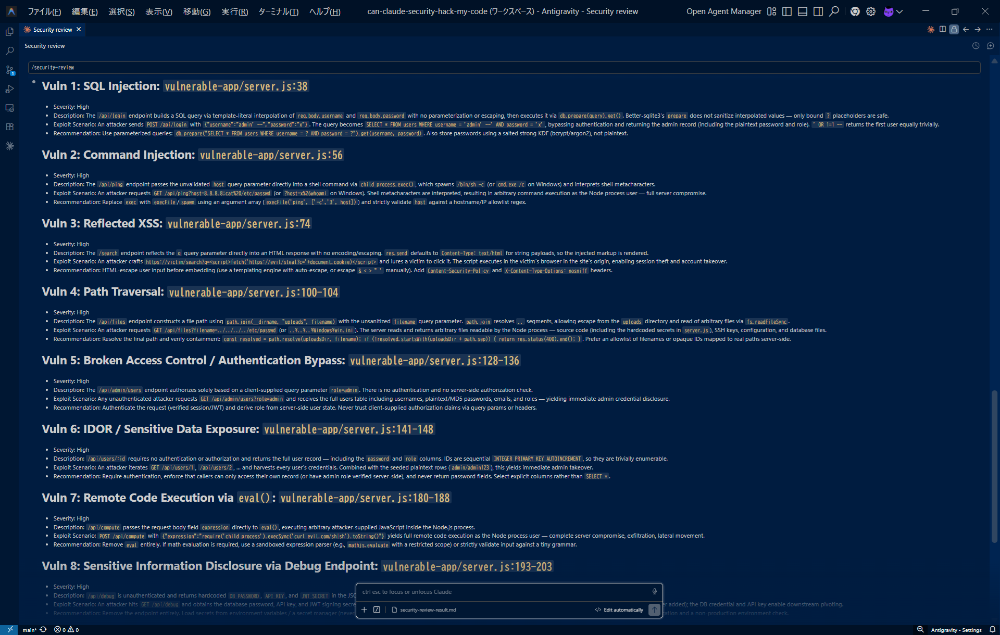
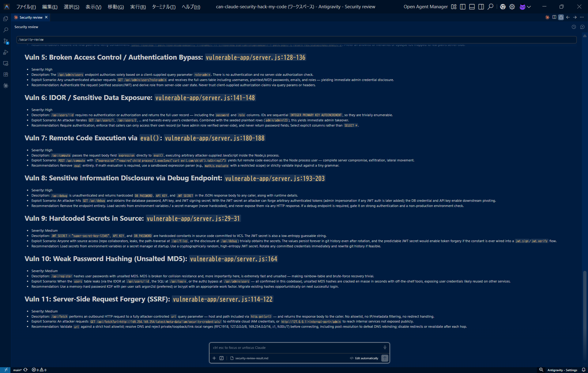

# can-claude-security-hack-my-code


> わざと脆弱性を仕込んだ。Claude Security は全部見つけられるか？ → **結果: 13個中 11個を検出**

> **この実験は進行中。** claude.ai/security（リポ全体スキャン）は 2026年5月時点で Enterprise プラン限定のため、まだ試せてない。現在の結果は `/security-review`（Claude Code のブランチ差分レビュー）によるもの。claude.ai/security が Max プランに展開され次第、リポ全体スキャンの結果を追記して比較する

## Claude Security とは

Anthropic が 2026年4月30日に発表した、AI でコードの脆弱性を見つけるスキャナー

SonarQube や Snyk のような従来の SAST（静的解析）ツールはルールとパターンマッチングでコードを検査する。Claude Security はアプローチが違う。Opus 4.7 がセキュリティ研究者のようにコードを読む。データフローを追いかけて、ファイルをまたいだ相互作用まで解析してくれる

見つけたら終わりじゃない。パッチの自動生成までやってくれる

| 項目 | 従来 SAST (SonarQube 等) | Claude Security |
|------|--------------------------|-----------------|
| 分析手法 | ルールベース・パターンマッチング | AI 推論・データフロー追跡 |
| 誤検知率 | 高い（未チューニング時 60-90%） | 低い（多段階検証パイプライン） |
| 文脈理解 | パターン照合のみ | コンポーネント間の相互作用を理解 |
| パッチ生成 | なし | あり（人間の確認は必須） |
| 結果の一貫性 | 決定的（毎回同じ結果） | 非決定的（AI 推論のため変動しうる） |

どれくらい見つけるのか。前身の Opus 4.6 の時点で、OSS コードベースから [500件以上の脆弱性](https://www.anthropic.com/news/claude-code-security)を発見した実績がある。数十年間、専門家レビューやファジングを回しても見つからなかったバグも含まれてる

ファジングというのは自動で大量の入力を投げてバグを探す手法で、ラインカバレッジ 100% でも抜けてたものを拾っている

## この実験について

**目的:** Claude Security が検出する 8カテゴリのうち、Node.js で再現可能な 7カテゴリを1つのアプリに仕込んで検出力を試す

**方法:** わざと脆弱性を含む Express アプリを作り、`/security-review`（Claude Code のスラッシュコマンド）でスキャンする

**検証ポイント:**

- 全カテゴリの脆弱性を見つけられるか
- 誤検出（false positive）はあるか
- 攻撃シナリオや修正案の質はどうか
- 重大度の判定は妥当か

## 仕込んだ脆弱性

[`vulnerable-app/server.js`](vulnerable-app/server.js) に 7カテゴリ・13個の脆弱性を仕込んだ

| # | Claude Security カテゴリ | 脆弱性 | エンドポイント | 何が起きるか |
|---|------------------------|--------|---------------|-------------|
| 1 | インジェクション | SQL Injection | `POST /api/login` | ユーザー入力がそのまま SQL に結合。`' OR 1=1 --` で認証突破 |
| 2 | インジェクション | Command Injection | `GET /api/ping` | ユーザー入力が `exec()` に直接渡される。OS コマンド実行可能 |
| 3 | インジェクション | XSS (Reflected) | `GET /search` | クエリパラメータがエスケープなしで HTML に埋め込み |
| 4 | XXE・ReDoS | ReDoS | `POST /api/validate-email` | 悪意ある入力で正規表現の処理が指数的に遅延 |
| 5 | パス・ネットワーク | Path Traversal | `GET /api/files` | `../../etc/passwd` でサーバー上の任意ファイル読み取り |
| 6 | パス・ネットワーク | SSRF | `GET /api/fetch` | 内部ネットワークへのリクエスト中継 |
| 7 | 認証・アクセス制御 | Auth Bypass | `GET /api/admin/users` | `?role=admin` だけで管理者 API にアクセス |
| 8 | 認証・アクセス制御 | IDOR | `GET /api/users/:id` | 認証なしで任意ユーザーの全情報（パスワード含む）取得 |
| 9 | 認証・アクセス制御 | CSRF 対策なし | `POST /api/users/:id/delete` | CSRF トークンなしでユーザー削除可能 |
| 10 | 暗号化 | 弱いハッシュ | `POST /api/register` | パスワードを MD5 でハッシュ化（脆弱） |
| 11 | 暗号化 | ハードコード認証情報 | ソースコード内 | JWT_SECRET、API_KEY、DB_PASSWORD が直書き |
| 12 | 逆シリアル化 | Unsafe eval | `POST /api/compute` | ユーザー入力を `eval()` で実行。任意コード実行 |
| 13 | プロトコル・エンコーディング | 情報漏洩 + ヘッダー欠如 | `GET /api/debug` | 認証情報・環境情報が丸見え。セキュリティヘッダーなし |

### 対象外

| カテゴリ | 理由 |
|---------|------|
| メモリ安全性（バッファオーバーフロー等） | C/C++/Rust 対象。Node.js では再現できない |

## 実験結果

全部は見つけられなかった。13個中 **11個を検出**、2つ逃した（検出率 84.6%）

`/security-review` で実行。誤検出（false positive）はゼロ。検出した 11個すべてに攻撃シナリオと修正案が付いてきた

### 検出結果サマリ

| # | 脆弱性 | 検出 | 重大度 |
|---|--------|------|--------|
| 1 | SQL Injection | ✅ | High |
| 2 | Command Injection | ✅ | High |
| 3 | XSS (Reflected) | ✅ | High |
| 4 | ReDoS | ❌ | - |
| 5 | Path Traversal | ✅ | High |
| 6 | SSRF | ✅ | Medium |
| 7 | Auth Bypass | ✅ | High |
| 8 | IDOR | ✅ | High |
| 9 | CSRF 対策なし | ❌ | - |
| 10 | 弱いハッシュ (MD5) | ✅ | Medium |
| 11 | ハードコード認証情報 | ✅ | Medium |
| 12 | Unsafe eval | ✅ | High |
| 13 | 情報漏洩 + ヘッダー欠如 | ✅ | High |

### 重大度の判定

RCE（リモートコード実行）やデータ漏洩に直結するもの（SQL Injection、Command Injection、eval、Path Traversal など）は High、直接の攻撃ではなく悪用に条件が必要なもの（SSRF、MD5 ハッシュ、ハードコード認証情報）は Medium。妥当な判定だった

### 検出できなかったもの

| 脆弱性 | 考えられる理由 |
|--------|--------------|
| ReDoS | 正規表現の計算量解析は静的解析では難易度が高い。パターンマッチングだけでは指数的バックトラッキングの検出が困難 |
| CSRF 対策なし | フレームワークレベルの設定不備（「何がないか」の検出）は、コード上に明示的な脆弱パターンが現れないため見つけにくい |

### スクリーンショット





### 検出結果の詳細

各脆弱性の説明・攻撃シナリオ・修正案は [`results/security-review-result.md`](results/security-review-result.md) に記録

## セットアップ（再現手順）

### 1. リポをクローン

```bash
git clone https://github.com/shumatsumonobu/can-claude-security-hack-my-code.git
cd can-claude-security-hack-my-code
```

### 2. 依存パッケージをインストール

```bash
cd vulnerable-app
npm install
```

### 3. サーバー起動（任意）

```bash
node server.js
# http://localhost:3000 で動作確認
```

### 4. /security-review でスキャン

Claude Code でこのリポを開いて実行：

```bash
/security-review
```

ブランチの差分に対してセキュリティレビューが走る

### 5. Claude Security でスキャン（オプション）

> 2026年5月時点で、claude.ai/security は Enterprise プランに先行提供中。Max / Team への展開時期は未定

1. [claude.ai/security](https://claude.ai/security) にアクセス
2. GitHub リポ一覧から `can-claude-security-hack-my-code` を選択
3. スキャン対象ディレクトリに `vulnerable-app` を指定
4. スキャン実行（数分〜数十分）

Enterprise プランであれば、`/security-review`（差分レビュー）と Claude Security（リポ全体スキャン）の検出結果を比較できる

## Claude Security の詳細

ここから先は Claude Security 自体の話。実験の背景として、あるいは導入を検討するときの参考に

### 検出カテゴリ

Claude Security が検出する 8カテゴリ

| # | カテゴリ | 概要 |
|---|---------|------|
| 1 | インジェクション攻撃 | SQL Injection、Command Injection、XSS。入力がコードの構造を変えるパターン |
| 2 | XXE・ReDoS | XML パーサーの悪用、正規表現による DoS |
| 3 | パス・ネットワーク関連 | ディレクトリトラバーサル、SSRF、オープンリダイレクト |
| 4 | 認証・アクセス制御 | 認証バイパス、権限昇格、IDOR/BOLA、CSRF |
| 5 | メモリ安全性 | バッファオーバーフロー、整数オーバーフロー（C/C++/Rust 対象） |
| 6 | 暗号化 | タイミングリーク、弱い暗号アルゴリズム |
| 7 | 逆シリアル化 | 信頼できないデータからのオブジェクト生成、RCE リスク |
| 8 | プロトコル・エンコーディング | キャッシュポイズニング、レイヤー間の不一致 |

### 使い方

| 方法 | 用途 | 詳細 |
|------|------|------|
| **claude.ai/security** | リポ全体スキャン | Web UI でリポを選んでスキャン。スケジュール実行・エクスポートも可能 |
| **`/security-review`** | 開発中の差分レビュー | Claude Code のスラッシュコマンド。ブランチの変更をチェック |
| **GitHub Action** | CI/CD 統合 | `anthropic/claude-code-security-review` で PR 時に自動レビュー |

### 対応プラン（2026年5月時点）

| プラン | `/security-review` | claude.ai/security |
|--------|-------------------|-------------------|
| Max ($100-200/月) | ✅ | 未提供（展開時期未定） |
| Team ($25/人/月) | ✅ | 未提供（展開時期未定） |
| Enterprise | ✅ | ✅ 先行提供中 |
| Pro / Free | ❌ | ❌ |

### 対応言語

公式ヘルプに対応言語の明示リストはないが、[公式ブログ](https://claude.com/blog/claude-security-public-beta)ではフレームワーク固有のパターン（Django のテンプレート自動エスケープ等）も理解すると記載されている

### 制限事項

- **GitHub リポジトリ限定**（GitLab, Bitbucket 非対応）
- **自分が所有/管理するリポのみ**スキャン可能
- **ソースコード限定**（バイナリ、ランタイムの挙動は対象外）
- **非決定的**（同じコードでもスキャンごとに結果が変わりうる）
- **静的解析のみ**（ビジネスロジックの欠陥は検出できない）
- **依存パッケージの既知 CVE は対象外**（ソースコード解析が主眼。CVE スキャンは Snyk や Dependabot の領域）

## 技術スタック

| 技術 | バージョン | 用途 |
|------|-----------|------|
| Node.js | 18+ | ランタイム |
| Express | 4.x | Web フレームワーク |
| better-sqlite3 | latest | インメモリ DB（テスト用） |
| Claude Security | Public Beta | AI 脆弱性スキャン |

## 参考リンク

- [Claude Security 公式ブログ](https://claude.com/blog/claude-security-public-beta) — 発表記事
- [Claude Security ヘルプ](https://support.claude.com/en/articles/14661296-use-claude-security) — 使い方ガイド
- [Claude Security GitHub Action](https://github.com/anthropics/claude-code-security-review) — CI/CD 統合
- [Anthropic 公式発表](https://www.anthropic.com/news/claude-code-security) — 技術詳細

## ライセンス

MIT
